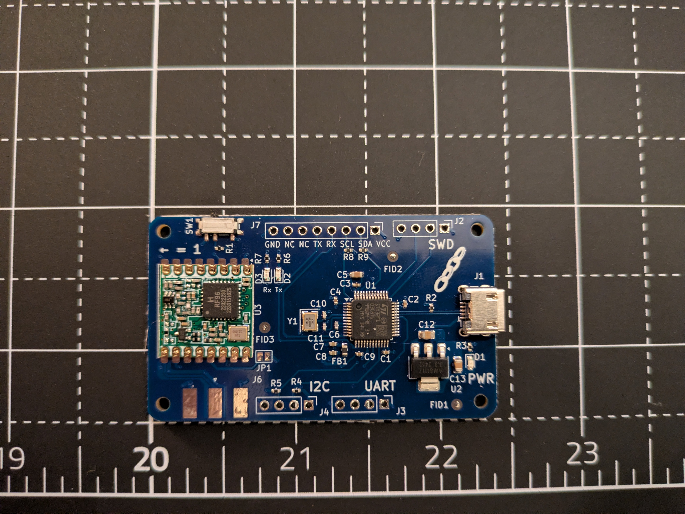

# linklet

A modular, LoRa enabled sensor bus

## Overview

- Linklet is an custom PCB design with an STM32 and RFM69HCW LoRa modules for sensing and IoT operations
- The base board exposes 1x UART and 1x I2C interface for basic sensors
- The board is powered over micro-USB
- Linklet also exposes a 1x8 pin socket connector for carrying daughter boards
    - The connector has 1x UART and 1x I2C interface for daughter boards
    - It makes it easy for swapping out different sensor arrays on the fly
